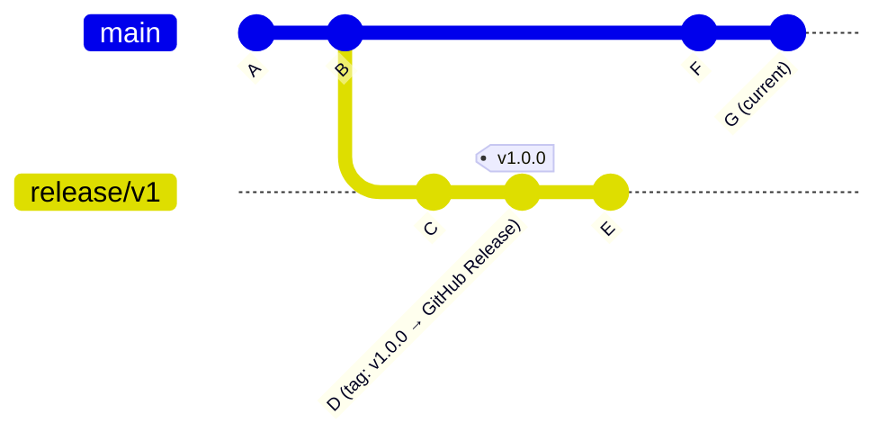

# decaf Script - GitHub Releases

A script specifically designed for the [decaf](https://github.com/levibostian/decaf) deployment automation tool. This script helps you work with GitHub Releases in your continuous deployment workflows. This script can be used to treat GitHub Releases as the single source of truth for determining the latest release version and to create new releases as part of your deployment process.

## What does this script do?

If you use GitHub's Releases feature to store and track the versions that you deploy, this script is for you. When you run decaf and need to specify where to determine successful releases, this script provides that functionality.

This script provides functionality to:

1. **Get the latest release** - Finds the most recent GitHub Release that is shared between a release branch and the current branch
2. **Set/create a release** - Creates a new GitHub Release with configurable options

# Getting Started

Run using decaf's `shebang` command in your deployment workflow.

**GitHub Actions Example**

```yaml
- uses: levibostian/decaf
  with:
    get_latest_release_current_branch: decaf shebang https://github.com/levibostian/decaf-script-github-releases-release-branch.git/shebang.sh@<version-here> get --release-branch main
    deploy: |
      # your deployment scripts here...
      # at some point (if using GitHub Releases as single source of truth run at the very end) create a new release with the script
      decaf shebang https://github.com/levibostian/decaf-script-github-releases-release-branch.git/shebang.sh@<version-here> set --release-branch main
    # Other decaf arguments...
```

Replace `<version-here>` with a [release](https://github.com/levibostian/decaf-script-github-releases-release-branch/releases). Latest: 

**Command Line Example**

```bash
decaf \
  --get-latest-release-current-branch "decaf shebang https://github.com/levibostian/decaf-script-github-releases-release-branch.git/shebang.sh@<version-here> get --release-branch main" \
  --deploy "your-script-here && decaf shebang https://github.com/levibostian/decaf-script-github-releases-release-branch.git/shebang.sh@<version-here> set --release-branch main"
```

> Note: Replace `your-script-here` with whatever commands you need to run as part of the deployment process before creating the release. Be sure to run the script *last* because once you create the release, decaf will consider the deployment successful and if you re-run decaf, it will not attempt to re-attempt the deployment.

# Commands

### Get Latest Release

In your *get latest release* script for decaf, use the `get` (or `get-latest-release`) command to find the latest GitHub Release that is common between a release branch and the current branch.

**Required flag:** `--release-branch <branch>` (alias: `-r`) — the name of the release branch to compare against.

#### How it works



The key insight is that **the commit returned is on the current branch**, not the release branch. Even though the GitHub Release points to a commit on `release/v1`, the script walks back through the release branch history to find the most recent commit that also lives on your current branch — in this example, commit `B`.

That shared commit is what decaf uses to know *"everything after B on the current branch is unreleased work."*

Step by step:

1. Fetches the latest GitHub Release from the repository.
2. Locates the commit for that release's tag on the **release branch** (not the current branch). If the tag is not found on the release branch, the script logs a message and exits.
3. Starting at that release tag commit, walks backwards through the release branch's commit history (oldest first).
4. For each release branch commit, checks whether that same commit SHA also exists on the current branch.
5. Returns the first common commit found, together with the GitHub Release name.
6. If no common commit is found, the script logs a message and returns nothing.

This approach ensures that when you are running on a separate branch (e.g. `main`), you correctly identify the most recent release that your branch shares history with — even though the release itself was created on a dedicated release branch.

Example usage:

```bash 
decaf shebang https://github.com/levibostian/decaf-script-github-releases-release-branch.git/shebang.sh@<version-here> get --release-branch release/v1

# Short alias for --release-branch
decaf shebang https://github.com/levibostian/decaf-script-github-releases-release-branch.git/shebang.sh@<version-here> get -r release/v1
```

### Set/Create Release

In your *deploy* script for decaf, use the `set` (or `set-latest-release`) command to create a new GitHub Release for the current branch.

When you run this command, it will:
- Create a new GitHub Release using the new version determined by the decaf get next release version script 
- Upload any assets that you created if you called the `set-assets` command beforehand

Example usage:

```bash
# Use the default settings to create the release
decaf shebang https://github.com/levibostian/decaf-script-github-releases-release-branch.git/shebang.sh@<version-here> set --release-branch main

# Or, with custom GitHub CLI arguments
decaf shebang https://github.com/levibostian/decaf-script-github-releases-release-branch.git/shebang.sh@<version-here> set --release-branch main --draft
```

### Set GitHub Release Assets

In your *deploy* script for decaf, use the `set-assets` (or `set-github-release-assets`) command to specify files that should be uploaded when creating a GitHub Release (when you call `set` command).

This command allows you to:
- Specify multiple files to upload as release assets
- Set custom display names for each asset

Example usage:

```bash
# After your deployment script runs, set the assets to upload. 
# Each asset follows the format: `"path/to/file#Display Name"`
decaf shebang https://github.com/levibostian/decaf-script-github-releases-release-branch.git/shebang.sh@<version-here> set-assets "dist/binary-linux#Linux Binary" "dist/binary-mac#Mac Binary"

# Then create the release (it will automatically include the assets)
decaf shebang https://github.com/levibostian/decaf-script-github-releases-release-branch.git/shebang.sh@<version-here> set --release-branch main
```
